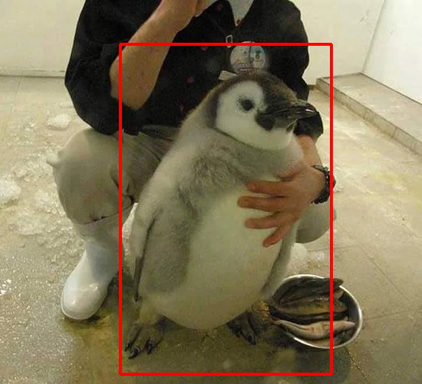
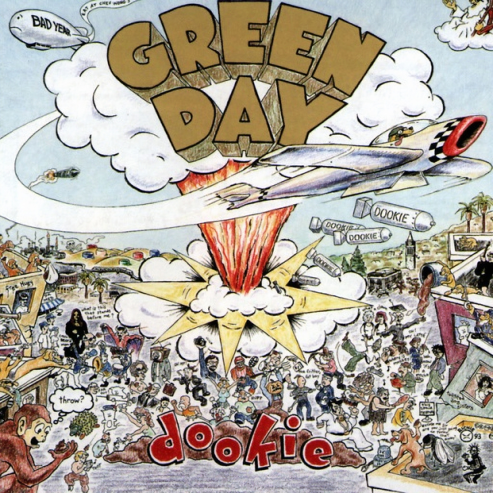
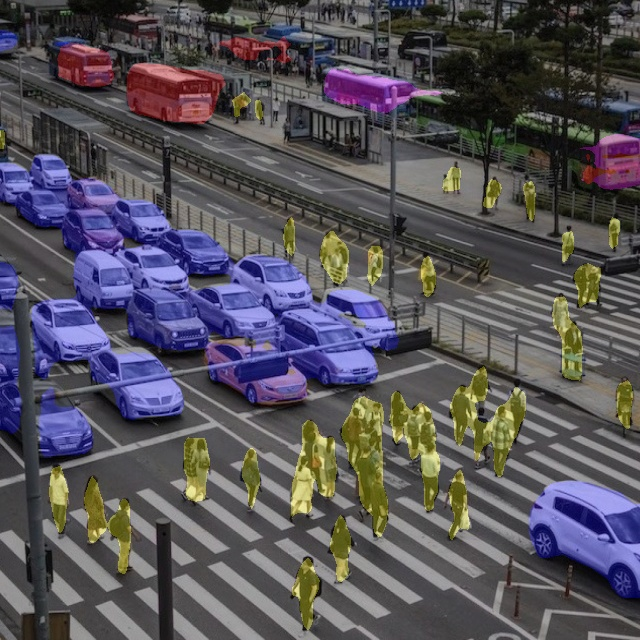

# ANE Examples

# Notebooks

### Object Detection - [yolov5](https://github.com/ultralytics/yolov5)

### Super Resolution - [srgan](https://github.com/john-rocky/CoreML-Models#srgan)

512 x 512             |  2048 x 2048
:-------------------------:|:-------------------------:
  |  

### Semantic Segmentation - [fcn_resnet50](https://pytorch.org/vision/main/models/generated/torchvision.models.segmentation.fcn_resnet50.html)

